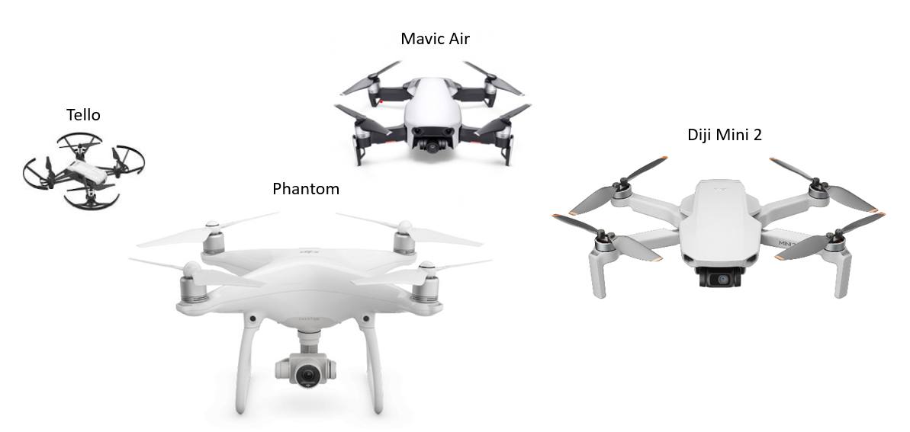
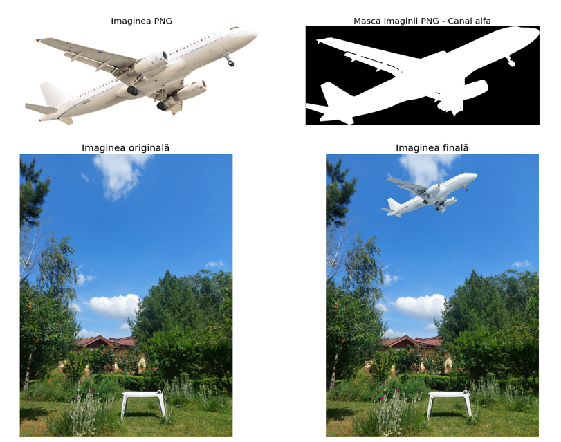
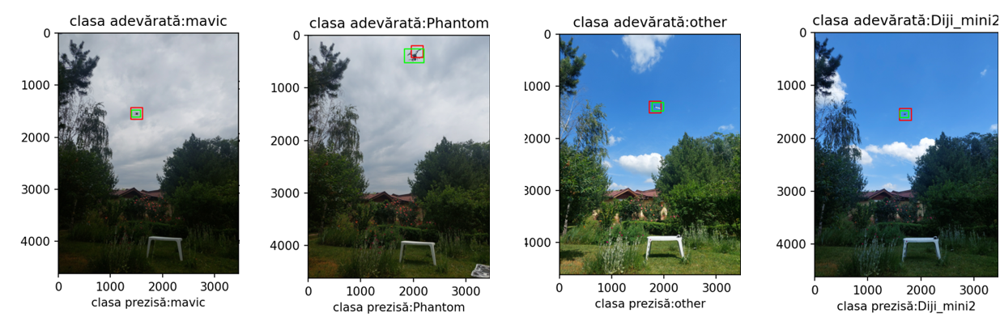

I created this application as part of my final project for the Bachelor of Engineering Degree. I developed an application to identify four drone models (Diji Mini, Mavic Air, Phantom, and Tello) and distinguish them from other objects like airplanes or birds that could be easily mistaken for drones by an observer.

In the initial phase of development, I researched practical methods and various specific algorithms that could be useful. I created the dataset using a fixed camera.

I augmented the images by adding birds and airplanes.

I used algorithms such as Non-Maximum Suppression (NMS) and Intersection over Union (IoU). In the data analysis step, I used data preprocessing procedures. This process involves essential steps to prepare the data for analysis, usually starting with collecting information and initially cleaning it to remove errors, missing values, or inconsistencies. Next, we explored and analyzed the dataset to better understand its characteristics. Various preprocessing techniques are applied, such as normalizing or scaling the data to bring it to an uniform scale or transforming categorical data into numeric form for use in machine learning algorithms.

I trained the model and I evaluated the model using performance metrics such as confusion matrix, F1-Score, recall, precision, and prediction time on an image.

